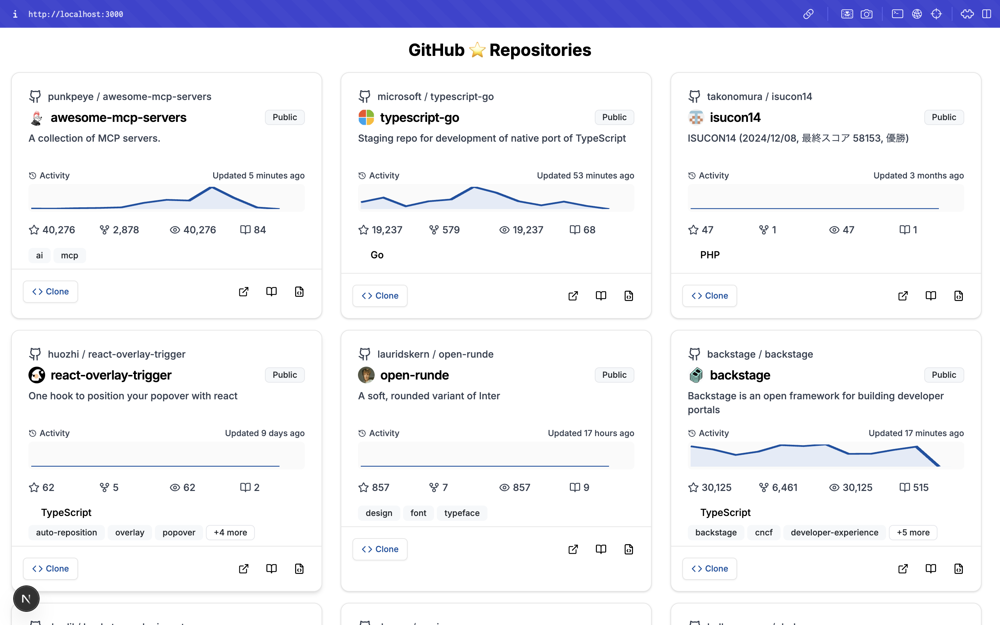

### GithubのStartをつけたリポジトリの活動履歴を確認できる


### 環境変数を設定
```sh
# 環境変数ファイルをコピー
cp .copy.env .env

# .envファイルを編集して以下の内容を設定
# GITHUB_PAT_TOKEN="Github PAT Token(Fine Grained)"
# USERNAME="Github Account Name"
```

### 起動
```sh
bun run dev
```